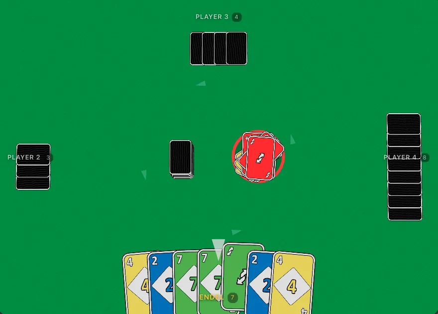
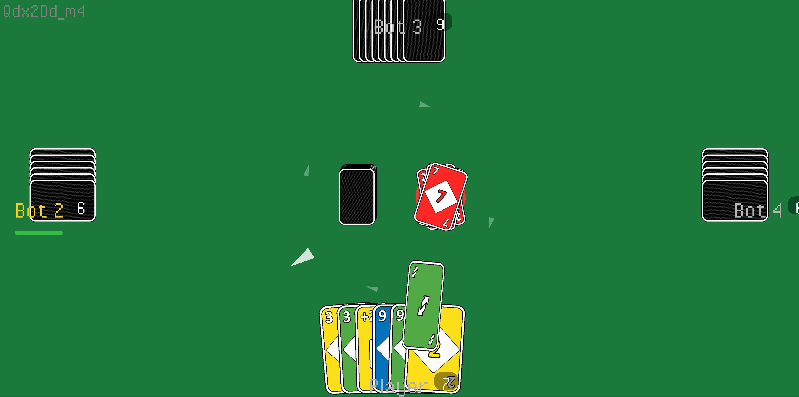
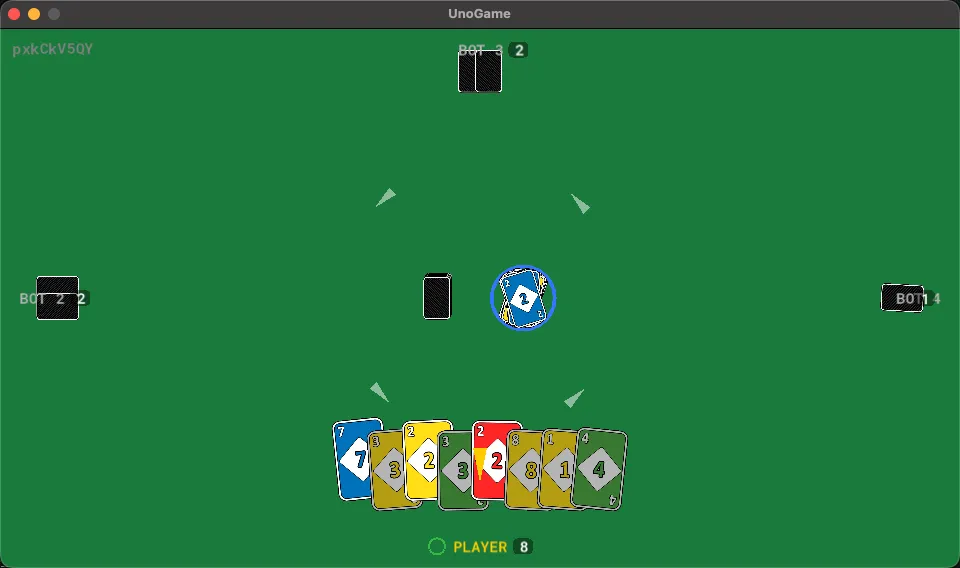
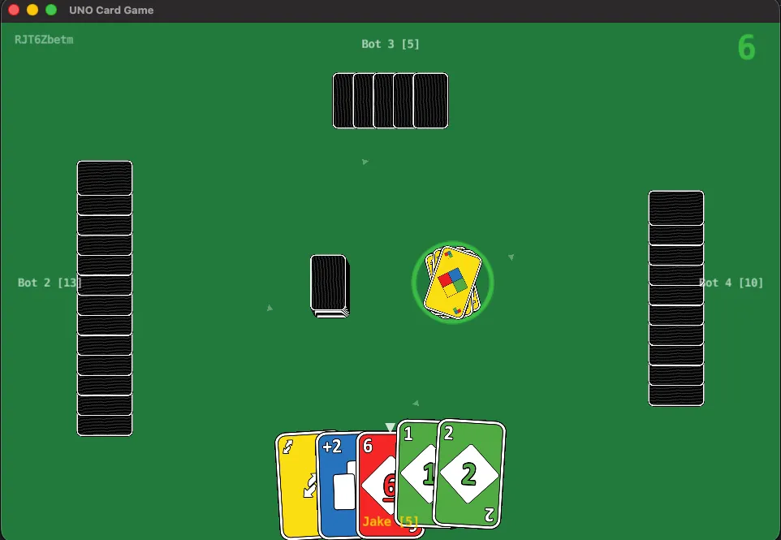
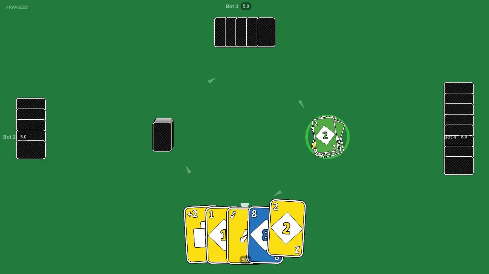
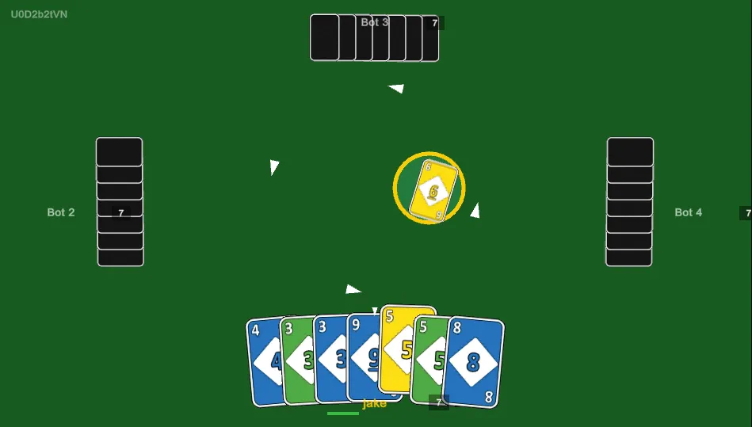

# Demo: Turn-Based UNO Card Game

A multiplayer UNO card game built with [Colyseus](https://colyseus.io/). Multiple frontend implementations share the same authoritative game server.

## Project Structure

The `server/` directory contains the shared game server powered by Colyseus 0.17.

| Client | Directory | Rendering | Platforms | Screenshot |
|---|---|---|---|---|
| React + R3F | [`web-react/`](web-react/) | 3D | Web |  |
| Haxe + Heaps | [`haxe/`](haxe/) | 2D | Web, Desktop |  |
| GameMaker | [`gamemaker/`](gamemaker/) | 2D | Desktop, Web |  |
| Defold | [`defold/`](defold/) | 2D | Desktop, Web |  |
| Godot | [`godot/`](godot/) | 2D | Desktop, Web |  |
| Unity | [`unity/`](unity/) | 3D | Desktop, Web, Mobile |  |

## Getting Started

Start the server:

```bash
cd server && npm install
npm run dev
```

See each client's README for setup instructions.

## Assets

Card art from [4Colour Cards](https://verzatiledev.itch.io/4colour) by VerzatileDev.

## Disclaimer

"UNO" is a registered trademark of Mattel, Inc. This project is not affiliated with, endorsed by, or sponsored by Mattel. It is an independent, open-source fan project created for educational and demonstration purposes only.

## License

MIT — See [LICENSE](LICENSE) file.
